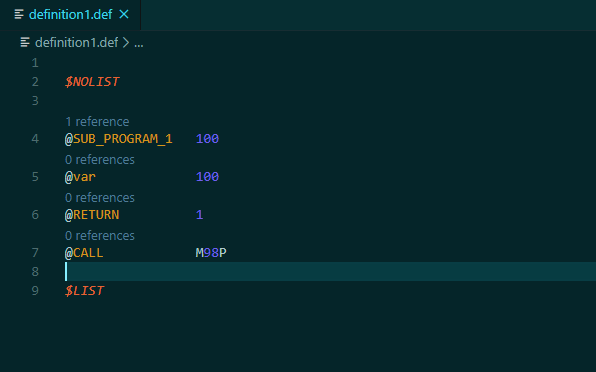

# Fanuc Macro Executor


[](https://github.com/iSorp/macro-executor/issues)
[](https://opensource.org/licenses/MIT)


Fanuc Macro Executor syntax highlighting, validating and project building 

## Features

* Compiling and linking
* Problem matcher
* Syntax highlighting
* Syntax validation
* Symbol provider
* CodeLens
* Lint features

**The program parsing is not yet complete implemented. There are cases where mistakes are not appropriate or not detected.**


### Validation


### Navigation


### References


### Implementations


### CodeLens reference counter


## Required file extension
* Macro files`.src`
* Include files `.def` 
* Link files `.lnk` 

## Coding conventions
* Uppercase for constants: `@MY_CONSTANT` 100
* Space between statements: `N9000 G01 X1`


## Default Commands

| Command | Key          |
|---------|--------------|
| Build   | Ctrl+Shift+B |
| Link    | Ctrl+Shift+L |
| Clean   | Ctrl+Shift+C |


## Extension Settings

This extension contributes the following settings:


* `macro.codelens.enable`: Reference counter for variable and label declarations
* `macro.validate.enable`: Syntax validation activation
* `macro.validate.workspace`: Syntax validation for entire workspace
* `macro.build.compiler`: Compiler Selection {MCOMPI, MCOMP0}
* `macro.build.controlType`: Control Type Selection {0, 30}
* `macro.build.makeFile`: Makefile
* `macro.project.exportPath`: Memoryfile Export Path
* `macro.project.sourcePath`: Source Path (.src)
* `macro.project.linkPath`: Linkfile and Library Path
* `macro.project.buildPath`: Build Files


## Building

### External build system
The building process can be performed by using an external script or the internal system. If an external script is used,
just set the path in `macro.build.makeFile`. If a Clean.bat in the same directory exists, it is used for the cleaning process.
The following arguments are passed to the Make.bat: 

1. path for memory file
2. option {make, clean}. When perforing the cleaning command and no Clean.bat is found "clean" is passed 
3. compiler {MCOMP0, MCOMPI}
4. compiler arg = control type {0, 30}

### Internal build system
If no Make.bat is used the internal building process is used.
>- The compiler must be available over the system path
>- The library (mex) must be located in `macro.project.linkPath` path 

Currently only a flat folder tree is supported e.g.:

```
project 
│
└───src
│      file1.src
│      file2.src
│   
└───def
│      file1.def
│      file1.def
│ 
└───lnk
       file1.lnk
       file1.lnk
       F30iA_01.MEX

```

-----------------------------------------------------------------------------------------------------------