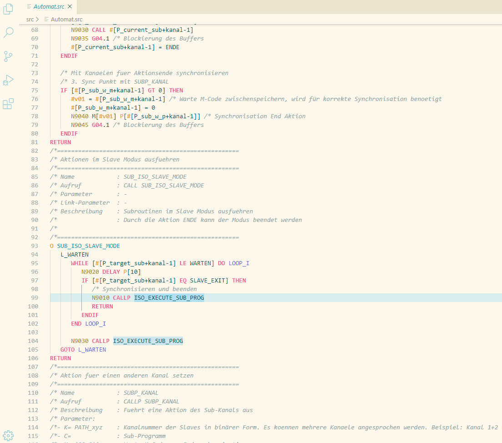
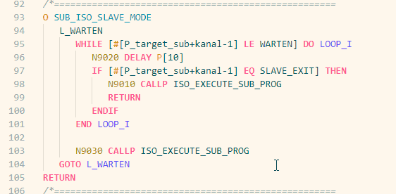

# Fanuc Macro Executor

Fanuc Macro Executor syntax highlighting and project building 

## Features

* Compiling and linking of fanuc macro executor projects.
* Problem matcher
* Syntax highlighting
* Syntax validation
* Symbol provider

### Compile

### Parameter definition

## Default Commands

| Command | Key          |
|---------|--------------|
| Build   | Ctrl+Shift+B |
| Link    | Ctrl+Shift+L |
| Clean   | Ctrl+Shift+C |

## Extension Settings

This extension contributes the following settings:

* `macro.build.compiler`: Compiler Selection {MCOMPI, MCOMP0}
* `macro.build.controlType`: Control Type Selection {0, 30}
* `macro.build.makeFile`: Makefile
* `macro.project.exportPath`: Memoryfile Export Path
* `macro.project.sourcePath`: Source Path (.src)
* `macro.project.linkPath`: Linkfile and Library Path
* `macro.project.buildPath`: Build Files

## Building

### External build system
The building process can be performed by using an external Make.bat or the internal system. If an external Make.bat is used,
just set the path in `macro.build.makeFile`. If a Clean.bat in the same directory exists, it is used for the cleaning process.
The following arguments are passed to the Make.bat: 

1. path for memory file
2. option {make, clean}. When perforing the cleaning command and no Clean.bat is found "clean" is passed 
3. compiler {MCOMP0, MCOMPI}
4. compiler arg = control type {0, 30}

### Internal build system
If no Make.bat is used the internal building process is used.
>- The compiler must be available over the system path
>- The library (mex) must be located in `macro.project.linkPath` path 

-----------------------------------------------------------------------------------------------------------